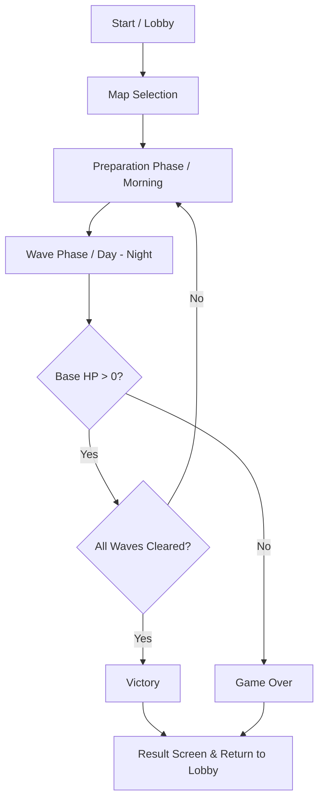
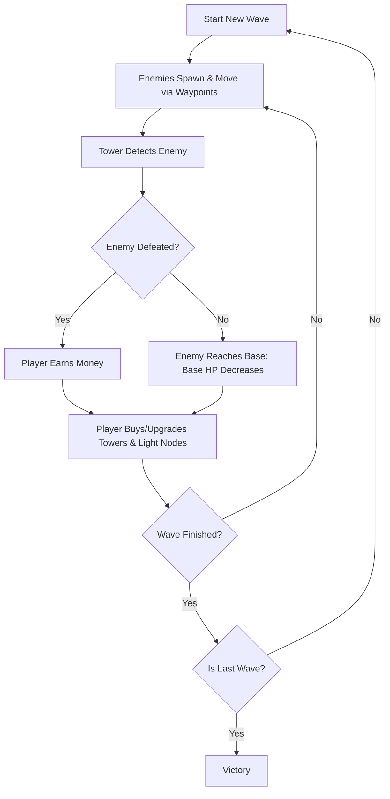
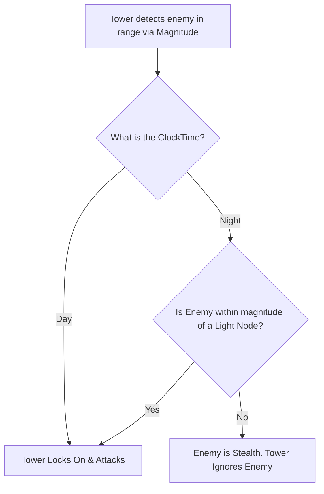
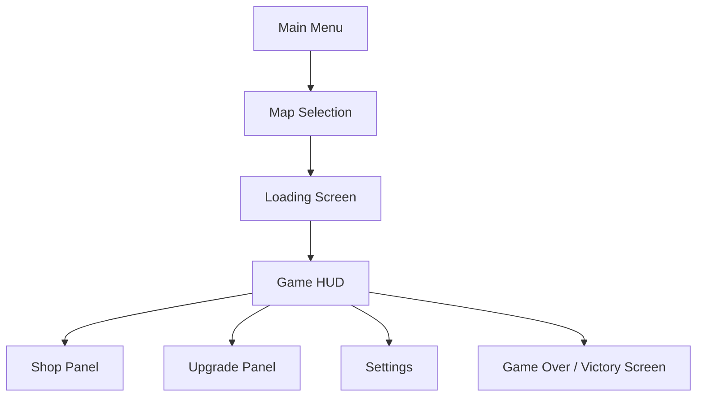

# AI Context & Product Document
## Project: Lumina Defense - The Nightfall Siege
**Platform:** Roblox
**Language:** Luau
**Workflow:** Rojo + Antigravity
**Developer:** vermilion10

---

## 1. PROJECT OVERVIEW
"Lumina Defense" is a strategic Tower Defense game on Roblox. It diverges from conventional tower defense by introducing a dynamic Day/Night cycle that directly impacts gameplay. 

**Core Mechanic (Light-based Vision & Stealth):**
* **Daytime:** Enemies spawn and move normally. Towers can detect and shoot them within their standard range.
* **Nighttime:** Enemies gain a "Stealth" status. Normal towers CANNOT detect or shoot them. To counter this, players must purchase and place "Light Nodes". If a stealth enemy walks within the radius of a Light Node, their stealth is stripped, allowing towers to target them.

## 2. SYSTEM ARCHITECTURE & ROBLOX HIERARCHY
The project strictly uses a Client-Server architecture managed via Rojo. The AI must structure code to fit this environment:

* **`src/server/` (Maps to `ServerScriptService`):**
  * `WaveManager.lua`: Controls enemy spawning, intermissions, and game over/victory states.
  * `EnemyAI.lua` / `PathNavigation.lua`: Handles server-side CFrame/Humanoid movement along waypoints.
  * `LightingController.lua`: Modulates `game.Lighting.ClockTime` and fires events when transitioning between Day and Night.
  * `EconomyManager.lua`: Securely handles player money addition/deduction.

* **`src/client/` (Maps to `StarterPlayerScripts` & `StarterGui`):**
  * `PlacementSystem.lua`: Mouse/Touch raycasting for grid-snapping Tower and Light Node placement.
  * `UIController.lua`: Manages HUD (Money, Base HP, Clock) and the Upgrade/Shop panels using Bento grid & glassmorphism UI principles.

* **`src/shared/` (Maps to `ReplicatedStorage`):**
  * `TowerAttack.lua` (Module): The core logic for Magnitude distance checking, target locking, and Light Node radius validation.
  * `RemoteEvents` folder: Strictly for Client-Server communication (e.g., RequestPlacement, UpdateMoney).

---

## 3. GAMEPLAY DIAGRAMS (GDD)
The AI must understand the flow of the game through these diagrams:

### A. Core Game Flow

### B. Core Loop (Economy & Combat)

### C. Combat Logic (The Light Mechanic)

### D. UI Screenflow

---

## 4. AI DEVELOPER CONSTRAINTS (CRITICAL)

When generating Luau code for this project, the AI MUST adhere to the following rules:

1. **Strict Typing:** Always use Luau strict typing by placing `--!strict` at the top of every script. Define types for complex tables and instances.
2. **Performance (RunService):** Never use `while wait()` or `wait()`. Use `task.wait()` or bind loops to `RunService.Heartbeat` / `RunService.RenderStepped` for smooth operations (especially for Tower Magnitude checks and projectile movement).
3. **Security:** Never trust the client. Tower placement, damage calculation, and economy changes MUST happen on the Server. The client should only send requests via `RemoteEvent` or `RemoteFunction`.
4. **No Deprecated APIs:** Do not use deprecated Roblox functions (e.g., use `task.spawn` instead of `coroutine.resume`, use `CFrame` math instead of body movers where applicable, use `Animator` instead of `Humanoid:LoadAnimation`).
5. **Asset References:** Assume 3D assets (generated via Python/Trellis and animated via Mixamo) are stored in `ReplicatedStorage.Assets`. Wait for them using `WaitForChild()`.
6. **Modularity:** Keep functions small. If a script exceeds 200 lines, suggest breaking it down into a `ModuleScript`.
